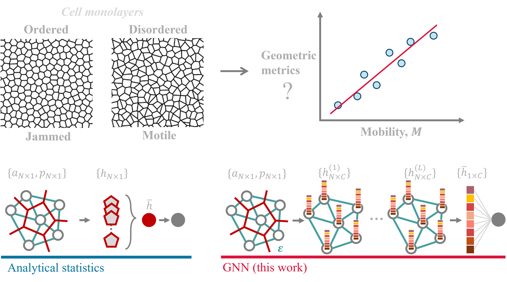

# Learning Collective Cell Migratory Dynamics from a Static Snapshot with Graph Neural Networks
by Haiqian Yang, Florian Meyer, Shaoxun Huang, Liu Yang, Cristiana Lungu, Monilola A. Olayioye, Markus J. Buehler, Ming Guo.

(Accepted for publication at PRX Life, 2024). [Link to the arXiv paper](https://arxiv.org/abs/2401.12196)

## Overview

Many recent works have shown that tissue fluidity is controlled by structural disorder, but it is still difficult to establish regression models from analytical geometric metrics that directly reflect collective cell dynamics.

In this work, we explore the use of graph neural networks to identify such a relation in both experimental and synthetic datasets.

## Code
Use `GraphNetCellMain.py` to train a GNN model `GraphNetCellModel.py` consisting of [PNA](https://pytorch-geometric.readthedocs.io/en/stable/generated/torch_geometric.nn.conv.PNAConv.html) layers to approximate the relation between a static snapshot of cell monolayer and the cell mobility.

The preprocessing code `GraphNetCellPreProcess.py` is also provided here. From a 2-D point cloud (e.g. cell coordinates), it generates Delaunay tessellation as graph edges, and calculates area and perimeter of the Voronoi tessellation as node features.

Some visualization functions are provided in `GraphNetCellUtils.py`.

Weights of a trained model are provided in `GraphNetCellExp_weights.pth`.

## Data
Download the data file from [here](https://doi.org/10.5281/zenodo.13988939).
